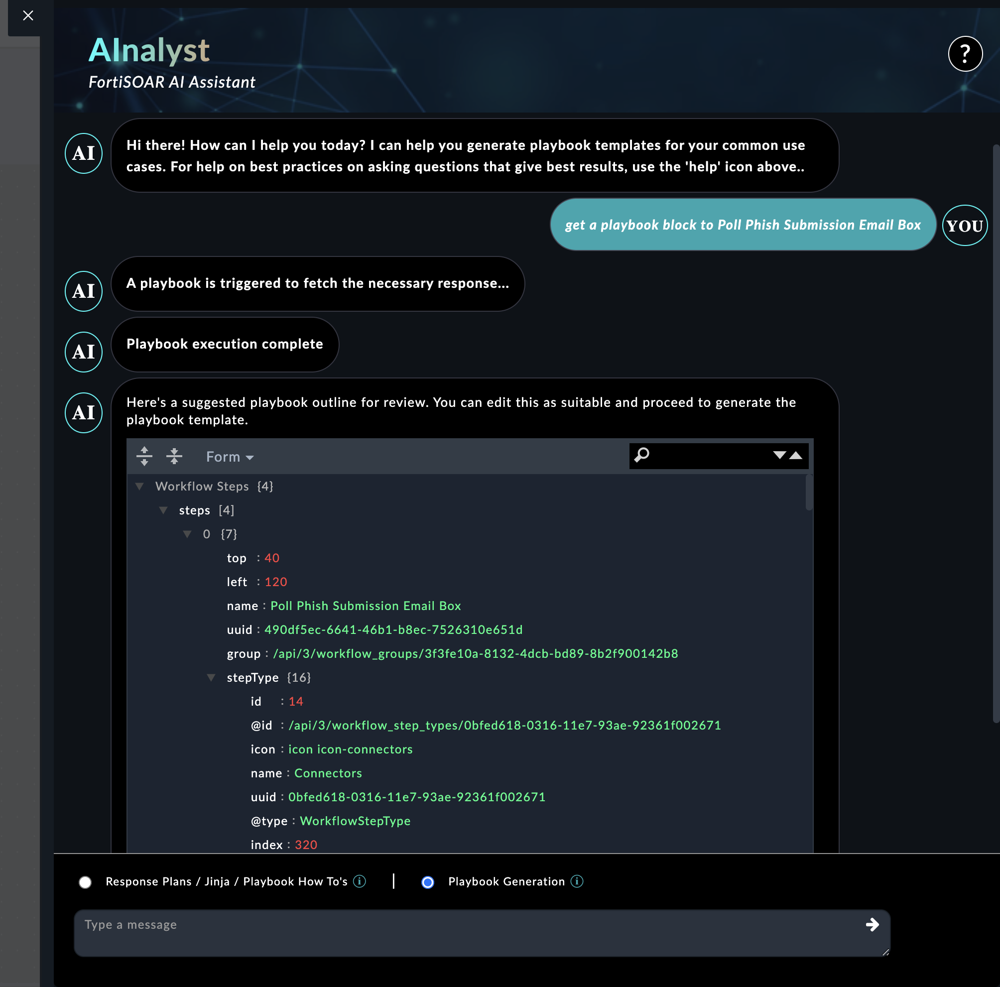
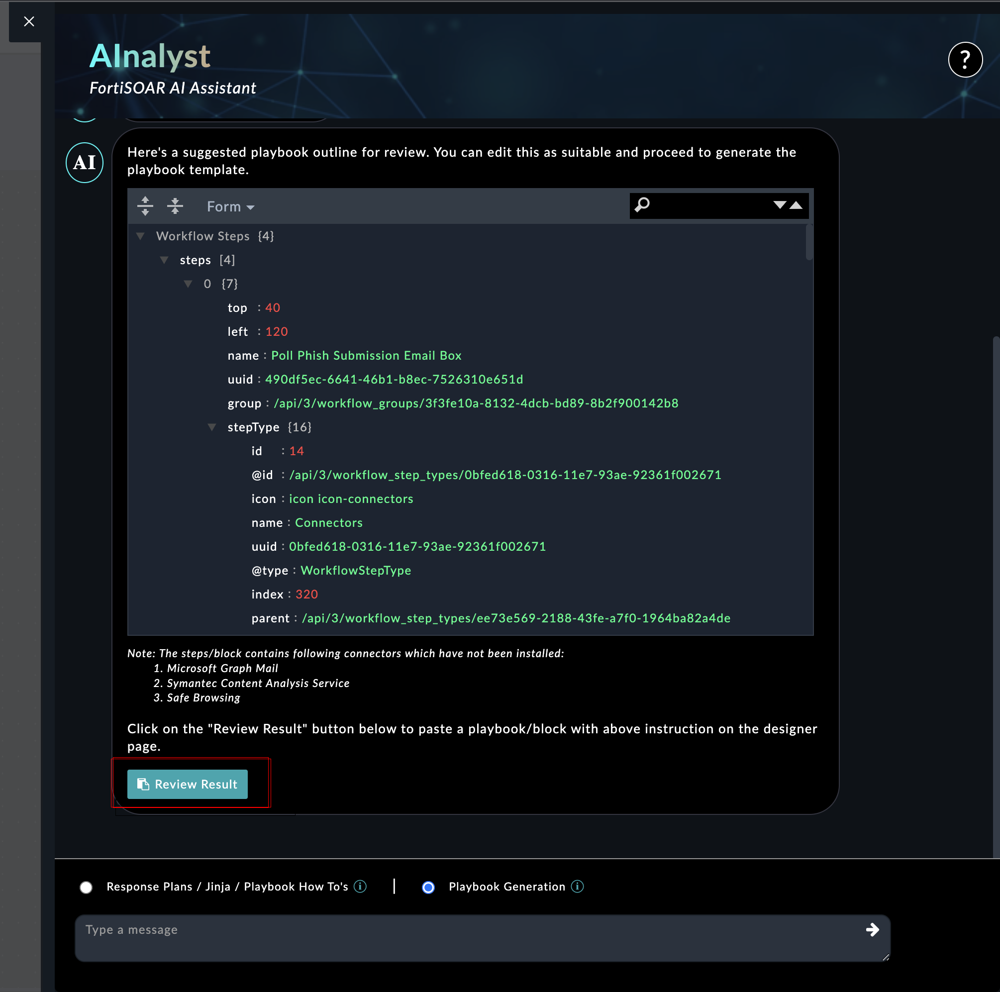

| [Home](../README.md) |
|----------------------|

# Usage

The AI Assisted Bot for FortiSOAR Playbook Designer is a valuable addition to your security toolkit, making playbook design more efficient, and insightful. Whether you're new to security automation or a seasoned professional, this bot empowers you to create robust security playbooks that enhance your organization's cyber defenses.

## Playbook Blocks Mode:

In Playbook Blocks mode, the AI Assisted Bot for FortiSOAR Playbook Designer provides an innovative approach to streamline playbook creation and block management. Here's how it works:

### Playbook Description:

When a prompt is received from the user, the bot dynamically generates a JSON description of the playbook block. This JSON format encapsulates the essential details of the playbook step, including actions, triggers, conditions, and relevant parameters.

When users click the "Review Result" button, the bot initiates the playbook block generation process. It takes the JSON description as an input parameter for creating the playbook block.

Using the input JSON, the bot triggers an automated process that swiftly generates the corresponding playbook block. The playbook block is automatically pasted on the Playbook Designer page, ready to use.

## Conversation Mode:
In Conversation Mode, the AI Assisted Bot takes on a more interactive role, offering valuable assistance through natural language conversations. 

| [Installation](./setup.md#installation) | [Configuration](./setup.md#configuration) |
|-----------------------------------------|-------------------------------------------|